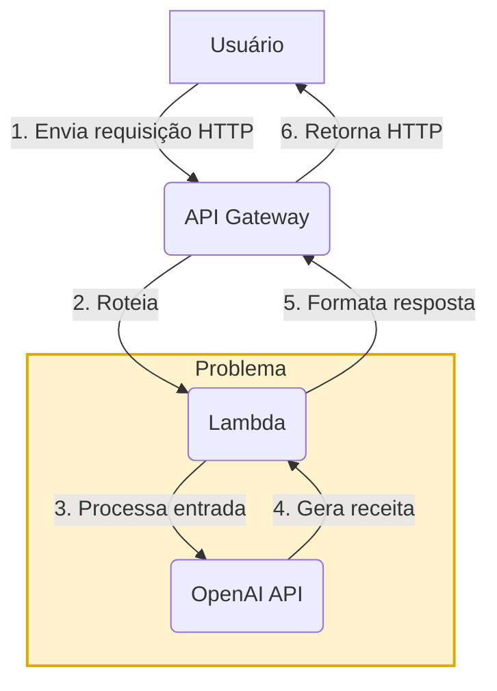

<div align="center">
   <h1>🥘 <strong>Recipe Improviser</strong></h1>
   <p>Gere receitas criativas a partir dos ingredientes que você tem em casa!<br>
   <b>API serverless (AWS Lambda + API Gateway) integrada ao ChatGPT (OpenAI).</b></p>
</div>

<hr/>

## ✨ Funcionalidades

- 🍳 <b>Geração de receitas</b> a partir de ingredientes informados
- 🎭 <b>Estilos:</b> <code>simple</code>, <code>funny</code>, <code>gourmet</code>, <code>chaotic</code>
- 🥦 <b>Restrições alimentares:</b> <code>vegan</code>, <code>vegetarian</code>, <code>gluten-free</code>, <code>lactose-free</code>, <code>low-cost</code>
- 🩺 <b>Endpoint de saúde:</b> <code>GET /health</code>
- 🧪 <b>Modo offline</b> para testes (ignora chamada à OpenAI)
- 📦 <b>Deploy simples</b> em um único Lambda

<hr/>

## 🚀 Como usar

### Pré-requisitos

- ☁️ Conta AWS (Lambda + API Gateway)
- 🟩 Node.js 18+
- 🤖 Chave da OpenAI (<code>OPENAI_API_KEY</code>)

### Deploy

<details>
<summary><b>1. Empacote o código</b></summary>

<b>Windows (PowerShell):</b>

```powershell
Compress-Archive -Path index.mjs, openai.mjs, utils.mjs -DestinationPath function.zip -Force
```

<b>macOS/Linux:</b>

```bash
zip -r function.zip index.mjs openai.mjs utils.mjs
```
</details>

<details>
<summary><b>2. Crie a função Lambda</b></summary>

1. Acesse o <a href="https://console.aws.amazon.com/lambda/" target="_blank"><b>Console AWS Lambda</b></a>
2. <b>Create function</b> → "Author from scratch":
    - 🔧 <b>Runtime:</b> Node.js 22.x
    - 📛 <b>Nome:</b> <code>recipe-improviser</code>
3. <b>Upload do pacote:</b>
    - Selecione "Upload from" → ".zip file"
    - Escolha o arquivo <code>function.zip</code> criado anteriormente
4. <b>Configurar variáveis de ambiente:</b>
    - <code>OPENAI_API_KEY</code>: sua chave da OpenAI
    - (Opcional) <code>SKIP_OPENAI</code>: <code>1</code> para modo de teste
</details>

<details>
<summary><b>3. Configure o API Gateway</b></summary>

1. Na função Lambda criada:
    - Clique em <b>Add trigger</b>
2. Selecione <b>API Gateway</b>:
    - <b>Tipo:</b> HTTP API
    - <b>Segurança:</b> Open (para desenvolvimento)
3. <b>Configurar rotas:</b>
    - <code>GET /health</code> (healthcheck)
    - <code>POST /recipe</code> (endpoint principal)
4. Após criação:
    - Anote a <b>URL de invocação</b> (ex: <code>https://[id].execute-api.[region].amazonaws.com</code>)
</details>

<hr/>

## 📡 Endpoints

### 🩺 Healthcheck

- <b>Método:</b> <code>GET</code>
- <b>Endpoint:</b> <code>/health</code>

<details>
<summary><b>Resposta</b></summary>

```json
{ "ok": true }
```
</details>

### 🍲 Gerar Receita

- <b>Método:</b> <code>POST</code>
- <b>Endpoint:</b> <code>/recipe</code>

<details>
<summary><b>Body de exemplo</b></summary>

```json
{
   "ingredients": ["tomate", "queijo", "macarrão"],
   "servings": 2,
   "style": "gourmet",
   "diet": "vegetarian"
}
```
</details>

<details>
<summary><b>Resposta</b></summary>

```json
{
   "title": "Macarrão ao Molho de Tomate e Queijo",
   "servings": 2,
   "time_minutes": 25,
   "ingredients_used": [
      "200g de macarrão",
      "2 tomates maduros",
      "100g de queijo (pode ser muçarela ou queijo parmesão)"
   ],
   "steps": [
      "1. Cozinhe o macarrão em água salgada fervente até ficar al dente...",
      "...etc"
   ],
   "tips": [
      "Para um toque especial, adicione manjericão fresco ou orégano ao molho."
   ],
   "warnings": [
      "Certifique-se de cozinhar o macarrão até que esteja completamente cozido."
   ]
}
```
</details>

<hr/>


## ⚠️ Limitações e Dicas

### Fluxo Síncrono Atual



<details>
<summary><b>Por que isso é um problema?</b></summary>

- A função Lambda fica <b>bloqueada</b> esperando a resposta do ChatGPT (média ~7,5s).
- Isso aumenta o <b>custo</b> (Lambda cobra por duração) e o <b>tempo de espera</b> do usuário.
- Para grandes volumes, pode causar lentidão e esgotar recursos.

</details>

Para produção, considere:
- Processamento assíncrono (SQS + Lambda Worker)
- Orquestração com Step Functions
- Cache de receitas populares (DynamoDB/S3)
- Streaming de respostas (quando disponível)

> <b>Veja também:</b><br>
> No repositório <a href="https://github.com/nathalia-acordi/recipe-improviser-pipeline/" target="_blank"><b>recipe-improviser-pipeline</b></a> demonstro como resolver esse problema usando uma arquitetura assíncrona, tornando o fluxo mais escalável e eficiente para grandes volumes e respostas demoradas.

<hr/>

## 👩‍💻 Contribua

<div align="center">
Sugestões, issues e PRs são super bem-vindos!<br/>
<a href="https://github.com/nathalia-acordi/recipe-improviser">⭐ Dê uma estrela no projeto!</a>
</div>

<hr/>


