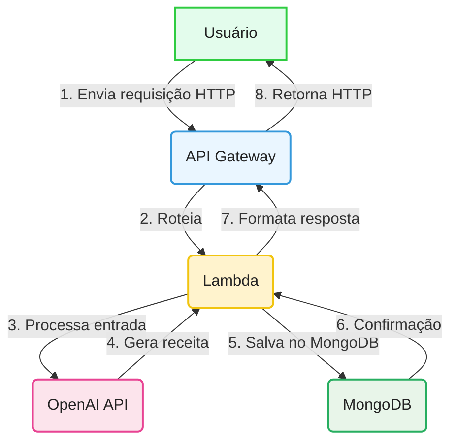

<div align="center">
   <h1>🥘 <strong>Recipe Improviser</strong></h1>
   <p>Gere receitas criativas a partir dos ingredientes que você tem em casa!<br>
   <b>API serverless (AWS Lambda + API Gateway) integrada ao ChatGPT (OpenAI) e persistência automática no MongoDB.</b></p>
</div>

<hr/>

## ✨ Funcionalidades

- 🍳 <b>Geração de receitas</b> a partir de ingredientes informados
- 🎭 <b>Estilos:</b> <code>simple</code>, <code>funny</code>, <code>gourmet</code>, <code>chaotic</code>
- 🥦 <b>Restrições alimentares:</b> <code>vegan</code>, <code>vegetarian</code>, <code>gluten-free</code>, <code>lactose-free</code>, <code>low-cost</code>
- 🩺 <b>Endpoint de saúde:</b> <code>GET /health</code>
- 🧪 <b>Modo offline</b> para testes (ignora chamada à OpenAI)
- 💾 <b>Salva receitas no MongoDB</b> automaticamente
- 📦 <b>Deploy simples</b> em um único Lambda

<hr/>

## 🗂️ O que faz cada arquivo principal?

<table>
   <tr>
      <th align="left">Arquivo</th>
      <th align="left">Função</th>
   </tr>
   <tr>
      <td><b>index.mjs</b></td>
      <td>Ponto de entrada da API. Faz o roteamento das requisições, valida os dados recebidos, chama a OpenAI para gerar a receita e salva o resultado no banco de dados.</td>
   </tr>
   <tr>
      <td><b>openai.mjs</b></td>
      <td>Responsável por montar os prompts (instruções) e fazer a chamada à API da OpenAI (ChatGPT), além de tratar e validar a resposta recebida.</td>
   </tr>
   <tr>
      <td><b>database.mjs</b></td>
      <td>Gerencia a conexão com o MongoDB e salva as receitas geradas na coleção <code>recipes</code>.</td>
   </tr>
   <tr>
      <td><b>utils.mjs</b></td>
      <td>Contém funções utilitárias (como resposta JSON padronizada) e listas de estilos e dietas aceitos, usadas para validação e padronização.</td>
   </tr>
</table>


<hr/>

## 🚀 Como usar

### Pré-requisitos

- ☁️ Conta AWS (Lambda + API Gateway)
- 🟩 Node.js 18+
- 🤖 Chave da OpenAI (<code>OPENAI_API_KEY</code>)
- 🍃 Instância ou cluster MongoDB acessível pela Lambda (<code>MONGODB_URI</code>)

### Deploy

<details>
<summary><b>1. Empacote seu código-fonte</b></summary>

Inclua apenas os arquivos `.mjs` e `package.json` (NÃO inclua `node_modules` se for usar Lambda Layer):

<b>Windows (PowerShell):</b>

```powershell
Compress-Archive -Path index.mjs,openai.mjs,utils.mjs,database.mjs,package.json -DestinationPath function.zip -Force
```

<b>macOS/Linux:</b>

```bash
zip -r function.zip index.mjs openai.mjs utils.mjs database.mjs package.json
```
</details>

<details>
<summary><b>2. Crie um Lambda Layer para dependências (recomendado)</b></summary>

1. Instale as dependências do projeto normalmente, incluindo o driver do MongoDB:
   ```bash
   npm install mongodb
   ```
2. Crie uma pasta chamada `nodejs` e mova o `node_modules` e o `package.json` para dentro dela:
   - <b>Windows (PowerShell):</b>
     ```powershell
     mkdir nodejs
     Copy-Item -Recurse -Force .\node_modules .\nodejs\
     Copy-Item -Force .\package.json .\nodejs\
     ```
   - <b>macOS/Linux:</b>
     ```bash
     mkdir nodejs
     cp -r node_modules nodejs/
     cp package.json nodejs/
     ```
3. Compacte a pasta `nodejs`:
   - <b>Windows (PowerShell):</b>
     ```powershell
     Compress-Archive -Path .\nodejs\* -DestinationPath layer.zip -Force
     ```
   - <b>macOS/Linux:</b>
     ```bash
     cd nodejs && zip -r ../layer.zip .
     cd ..
     ```
4. No console AWS Lambda:
   - Vá em "Layers" > "Create layer"
   - Faça upload do `layer.zip`
   - Escolha o runtime Node.js 18.x ou superior
5. Anexe o layer à sua função Lambda
6. No deploy da função, NÃO inclua `node_modules` (apenas seus arquivos `.mjs` e `package.json`)

> Só empacote o `node_modules` junto com o código principal se não for usar Layer (não recomendado para produção).
</details>

<details>
<summary><b>3. Crie a função Lambda</b></summary>

1. Acesse o <a href="https://console.aws.amazon.com/lambda/" target="_blank"><b>Console AWS Lambda</b></a>
2. Clique em "Create function" → "Author from scratch":
   - Runtime: Node.js 22.x
   - Nome: <code>recipe-improviser</code>
3. Upload do pacote:
   - Selecione "Upload from" → ".zip file"
   - Escolha o arquivo <code>function.zip</code> criado anteriormente
4. Configurar variáveis de ambiente:
   - <code>OPENAI_API_KEY</code>: sua chave da OpenAI
   - <code>MONGODB_URI</code>: string de conexão do seu MongoDB Atlas ou instância
   - (Opcional) <code>MONGODB_DB</code>: nome do banco (default: <code>recipeimproviser</code>)
   - (Opcional) <code>SKIP_OPENAI</code>: <code>1</code> para modo de teste
</details>

<details>
<summary><b>4. Configure o API Gateway</b></summary>

1. Na função Lambda criada:
   - Clique em <b>Add trigger</b>
2. Selecione <b>API Gateway</b>:
   - <b>Tipo:</b> HTTP API
   - <b>Segurança:</b> Open (para desenvolvimento)
3. <b>Configurar rotas:</b>
   - <code>GET /health</code> (healthcheck)
   - <code>POST /recipe</code> (endpoint principal)
4. Após criação:
   - Anote a <b>URL de invocação</b> (ex: <code>https://[id].execute-api.[region].amazonaws.com</code>)
</details>

## 💾 Persistência no MongoDB

Cada receita gerada é salva automaticamente na coleção <code>recipes</code> do MongoDB, junto com informações de estilo, dieta, ingredientes e data de criação.

<details>
<summary><b>Exemplo de documento salvo</b></summary>

```json
{
  "title": "Macarrão ao Molho de Tomate e Queijo",
  "servings": 2,
  "time_minutes": 25,
  "ingredients_used": ["200g de macarrão", ...],
  "steps": ["1. Cozinhe o macarrão...", ...],
  "tips": ["Para um toque especial..."],
  "warnings": ["Certifique-se de..."],
  "style": "gourmet",
  "diet": "vegetarian",
  "requested_ingredients": ["tomate", "queijo", "macarrão"],
  "createdAt": "2025-09-10T19:00:00.000Z"
}
```
</details>

<hr/>

## 📡 Endpoints

### 🩺 Healthcheck

- <b>Método:</b> <code>GET</code>
- <b>Endpoint:</b> <code>/health</code>

<details>
<summary><b>Resposta</b></summary>

```json
{ "ok": true }
```
</details>

### 🍲 Gerar Receita

- <b>Método:</b> <code>POST</code>
- <b>Endpoint:</b> <code>/recipe</code>

<details>
<summary><b>Body de exemplo</b></summary>

```json
{
   "ingredients": ["tomate", "queijo", "macarrão"],
   "servings": 2,
   "style": "gourmet",
   "diet": "vegetarian"
}
```
</details>

<details>
<summary><b>Resposta</b></summary>

```json
{
   "title": "Macarrão ao Molho de Tomate e Queijo",
   "servings": 2,
   "time_minutes": 25,
   "ingredients_used": [
      "200g de macarrão",
      "2 tomates maduros",
      "100g de queijo (pode ser muçarela ou queijo parmesão)"
   ],
   "steps": [
      "1. Cozinhe o macarrão em água salgada fervente até ficar al dente...",
      "...etc"
   ],
   "tips": [
      "Para um toque especial, adicione manjericão fresco ou orégano ao molho."
   ],
   "warnings": [
      "Certifique-se de cozinhar o macarrão até que esteja completamente cozido."
   ]
}
```
</details>

<hr/>

## ⚠️ Limitações e Dicas

### Fluxo Síncrono Atual



<details>
<summary><b>Por que isso é um problema?</b></summary>

- A função Lambda fica <b>bloqueada</b> esperando a resposta do ChatGPT <b>e do MongoDB</b> (média ~7,5s ou mais).
- Isso aumenta o <b>custo</b> (Lambda cobra por duração) e o <b>tempo de espera</b> do usuário.
- Para grandes volumes, pode causar lentidão e esgotar recursos.

</details>

Para produção, considere:
- Processamento assíncrono (SQS + Lambda Worker)
- Orquestração com Step Functions
- Cache de receitas populares (DynamoDB/S3)
- Streaming de respostas (quando disponível)

> <b>Veja também:</b><br>
> No repositório <a href="https://github.com/nathalia-acordi/recipe-improviser-pipeline/" target="_blank"><b>recipe-improviser-pipeline</b></a> demonstro como resolver esse problema usando uma arquitetura assíncrona, tornando o fluxo mais escalável e eficiente para grandes volumes e respostas demoradas.

<hr>
<div align="center">
   <h3>💬 Ficou com dúvidas, quer trocar ideias ou colaborar?</h3>
   <b>Entre em contato comigo!</b><br><br>
   <a href="mailto:nathaliaccord@gmail.com" target="_blank">
      
   </a>
   <a href="https://www.linkedin.com/in/nath%C3%A1lia-acordi-0a564b223/" target="_blank">
      
   </a>
   <br><br>
   Se curtiu o projeto, dê uma estrela! ⭐
</div>
</hr>
