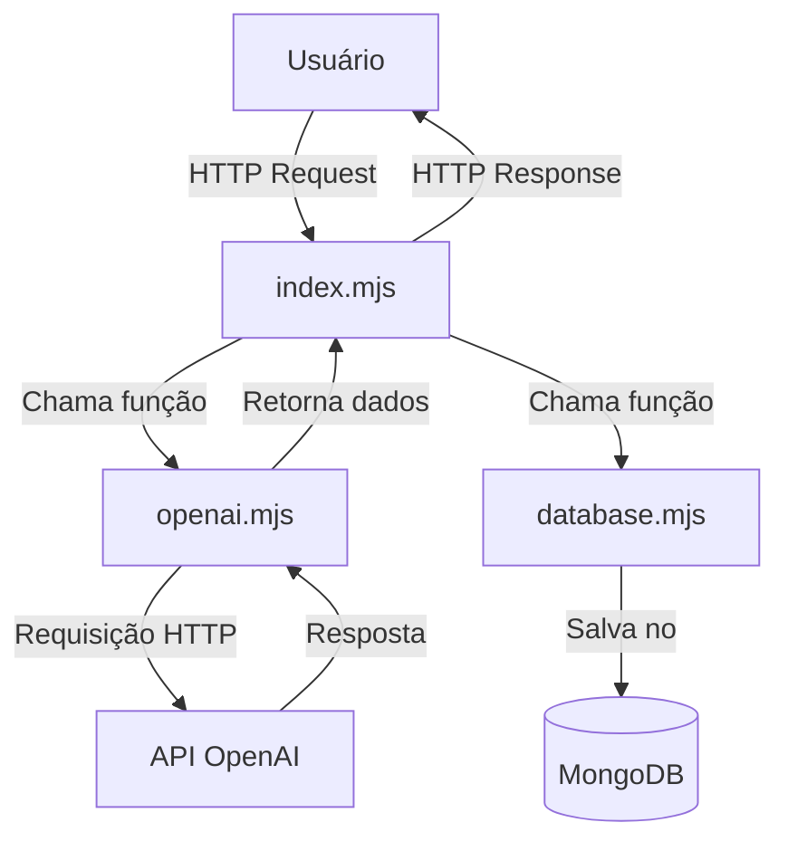
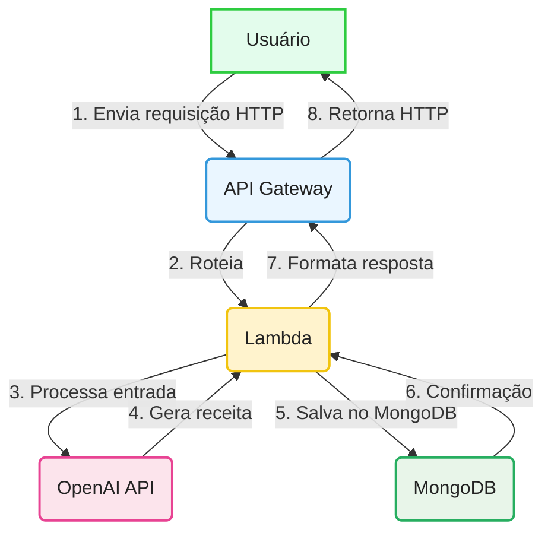

<div align="center">

# 🥘 Recipe Improviser

<b>Gere receitas criativas a partir dos ingredientes que você tem em casa!</b><br>

<!-- Badges lado a lado, centralizados e menores -->
<p align="center">
  
  
  
  
  
</p>

</div>

---


## 🗂️ O que faz cada arquivo?

| Arquivo         | Função                                                                                                                        |
| --------------- | ----------------------------------------------------------------------------------------------------------------------------- |
| **index.mjs**   | Ponto de entrada da API. Faz o roteamento das requisições, valida os dados recebidos, chama a função do openai.mjs para gerar a receita (que por sua vez faz a chamada à OpenAI) e salva o resultado no banco de dados. |
| **openai.mjs**  | Responsável por montar os prompts (instruções), fazer a chamada HTTP à API da OpenAI (ChatGPT) e tratar/validar a resposta recebida. |
| **database.mjs**| Gerencia a conexão com o MongoDB usando Mongoose, define o schema das receitas e implementa a função para salvar receitas na coleção `recipes`. |
| **utils.mjs**   | Contém funções utilitárias (como resposta JSON padronizada) e listas de estilos e dietas aceitos, usadas para validação e padronização. |



## ✨ Funcionalidades

- 🍳 <b>Geração de receitas</b> a partir de ingredientes informados
- 🎭 <b>Estilos:</b> <code>simple</code>, <code>funny</code>, <code>gourmet</code>, <code>chaotic</code>
- 🥦 <b>Restrições alimentares:</b> <code>vegan</code>, <code>vegetarian</code>, <code>gluten-free</code>, <code>lactose-free</code>, <code>low-cost</code>
- 🩺 <b>Endpoint de saúde:</b> <code>GET /health</code>
- 🧪 <b>Modo offline</b> para testes (ignora chamada à OpenAI)
- 💾 <b>Salva receitas no MongoDB</b> automaticamente
- 📦 <b>Deploy simples</b> em um único Lambda


---

## 🚀 Como usar


### Pré-requisitos

- Conta AWS (Lambda + API Gateway)
- Node.js 22.x (igual ao runtime da Lambda)
- Chave da OpenAI (`OPENAI_API_KEY`)
- Instância ou cluster MongoDB acessível pela Lambda (`MONGODB_URI`)

### Deploy


<details>
<summary><b>1. Empacote seu código-fonte</b></summary>

Inclua apenas os arquivos `.mjs` e `package.json` (NÃO inclua `node_modules`, usaremos Lambda Layer):

<b>Windows (PowerShell):</b>

```powershell
Compress-Archive -Path index.mjs,openai.mjs,utils.mjs,database.mjs,package.json -DestinationPath function.zip -Force
```

<b>macOS/Linux:</b>

```bash
zip -r function.zip index.mjs openai.mjs utils.mjs database.mjs package.json
```
</details>

<details>
<summary><b>2. Crie a Lambda Layer com Mongoose</b></summary>


<b>1. Crie a pasta do layer e instale o Mongoose:</b>

<b>Windows (PowerShell):</b>
```powershell
mkdir nodejs
cd nodejs
npm init -y
npm install mongoose@8.18.1
cd ..
```

<b>macOS/Linux:</b>
```bash
mkdir nodejs
cd nodejs
npm init -y
npm install mongoose@8.18.1
cd ..
```


<b>2. Compacte a pasta nodejs (ela deve estar na raiz do zip!):</b>

<b>Windows (PowerShell):</b>
```powershell
Compress-Archive -Path .\nodejs -DestinationPath layer.zip -Force
```

<b>macOS/Linux:</b>
```bash
zip -r layer.zip nodejs
```

<b>3. No console AWS Lambda:</b>
   - Vá em "Layers" > "Create layer"
   - Faça upload do <code>layer.zip</code>
   - Escolha o runtime Node.js 22.x
<b>4. Anexe a Layer à sua função Lambda</b>
<b>5. No deploy da função, NÃO inclua node_modules</b> (apenas seus arquivos .mjs e package.json)

Assim, sua função Lambda usará o Mongoose do layer, mantendo o deploy enxuto e rápido!
</details>

<details>
<summary><b>2. Crie a função Lambda</b></summary>

1. Acesse o <a href="https://console.aws.amazon.com/lambda/" target="_blank"><b>Console AWS Lambda</b></a>
2. Clique em "Create function" → "Author from scratch":
   - Runtime: Node.js 22.x
   - Nome: <code>recipe-improviser</code>
3. Upload do pacote:
   - Selecione "Upload from" → ".zip file"
   - Escolha o arquivo <code>function.zip</code> criado anteriormente
4. Configurar variáveis de ambiente:
   - <code>OPENAI_API_KEY</code>: sua chave da OpenAI
   - <code>MONGO_URI</code>: string de conexão do seu MongoDB Atlas ou instância
   - (Opcional) <code>MONGODB_DB</code>: nome do banco (default: <code>recipeimproviser</code>)
   - (Opcional) <code>SKIP_OPENAI</code>: <code>1</code> para modo de teste
</details>


<details>
<summary><b>3. Configure o API Gateway</b></summary>

1. Na função Lambda criada:
   - Clique em <b>Add trigger</b>
2. Selecione <b>API Gateway</b>:
   - <b>Tipo:</b> HTTP API
   - <b>Segurança:</b> Open (para desenvolvimento)
3. <b>Configurar rotas:</b>
   - <code>GET /health</code> (healthcheck)
   - <code>POST /recipe</code> (endpoint principal)
4. Após criação:
   - Anote a <b>URL de invocação</b> (ex: <code>https://[id].execute-api.[region].amazonaws.com</code>)
</details>


---


## 💾 Persistência no MongoDB

Cada receita gerada é salva automaticamente na coleção <code>recipes</code> do MongoDB, junto com informações de estilo, dieta, ingredientes e data de criação. O acesso ao banco é feito via Mongoose, utilizando uma Lambda Layer para as dependências.

<details>
<summary><b>Exemplo de documento salvo</b></summary>

```json
{
  "title": "Macarrão ao Molho de Tomate e Queijo",
  "servings": 2,
  "time_minutes": 25,
  "ingredients_used": ["200g de macarrão", ...],
  "steps": ["1. Cozinhe o macarrão...", ...],
  "tips": ["Para um toque especial..."],
  "warnings": ["Certifique-se de..."],
  "style": "gourmet",
  "diet": "vegetarian",
  "requested_ingredients": ["tomate", "queijo", "macarrão"],
  "createdAt": "2025-09-10T19:00:00.000Z"
}
```
</details>


---

## 📡 Endpoints

### 🩺 Healthcheck

- <b>Método:</b> <code>GET</code>
- <b>Endpoint:</b> <code>/health</code>

<details>
<summary><b>Exemplo de resposta</b></summary>

```json
{
   "status": "ok"
}
```

</details>

### 🍲 Gerar Receita

- <b>Método:</b> <code>POST</code>
- <b>Endpoint:</b> <code>/recipe</code>

<details>
<summary><b>Exemplo de payload e resposta</b></summary>

<b>Payload (body):</b>
```json
{
   "ingredients": ["tomate", "queijo", "macarrão"],
   "servings": 2,
   "style": "gourmet",
   "diet": "vegetarian"
}
```

<b>Resposta:</b>
```json
{
   "title": "Macarrão ao Molho de Tomate e Queijo",
   "servings": 2,
   "time_minutes": 25,
   "ingredients_used": ["200g de macarrão", "tomate", "queijo"],
   "steps": [
      "1. Cozinhe o macarrão conforme as instruções da embalagem.",
      "2. Em uma panela, refogue o tomate picado.",
      "3. Adicione o queijo e misture até derreter.",
      "4. Misture o molho ao macarrão e sirva."
   ],
   "tips": ["Para um toque especial, adicione manjericão fresco."],
   "warnings": ["Cuidado para não queimar o queijo."],
   "style": "gourmet",
   "diet": "vegetarian",
   "requested_ingredients": ["tomate", "queijo", "macarrão"],
   "createdAt": "2025-09-10T19:00:00.000Z"
}
```

</details>

## 🧪 Quer testar pelo console da AWS?

Você pode simular requisições diretamente pelo console da AWS Lambda usando os exemplos abaixo:

<details>
<summary><b>Exemplo de evento <code>GET /health</code></b></summary>

```json
{
   "requestContext": {
      "http": {
         "method": "GET",
         "path": "/health"
      }
   }
}
```

</details>

<details>
<summary><b>Exemplo de evento <code>POST /recipe</code></b></summary>

```json
{
   "requestContext": {
      "http": {
         "method": "POST",
         "path": "/recipe"
      }
   },
   "body": "{\"ingredients\":[\"tomate\",\"queijo\",\"macarrão\"],\"servings\":2,\"style\":\"gourmet\",\"diet\":\"vegetarian\"}",
   "headers": {
      "Content-Type": "application/json"
   }
}
```

</details>

<details>
<summary><b>Testar sem gastar créditos da OpenAI (<code>SKIP_OPENAI</code>)</b></summary>

Se quiser testar sem consumir créditos da OpenAI, basta definir a variável de ambiente <code>SKIP_OPENAI=1</code> na configuração da Lambda. Assim, a função retorna uma receita mockada, sem chamar a API da OpenAI.<br><br>
Ideal para validar integração, deploy e persistência no MongoDB sem custo!

</details>

---


## ⚠️ Limitações e Dicas

### Fluxo Síncrono Atual



<details>
<summary><b>Por que isso é um problema?</b></summary>

- A função Lambda fica <b>bloqueada</b> esperando a resposta do ChatGPT <b>e do MongoDB</b> (média ~12s ou mais).
- Isso aumenta o <b>custo</b> (Lambda cobra por duração) e o <b>tempo de espera</b> do usuário.
- Para grandes volumes, pode causar lentidão e esgotar recursos.

</details>

Para produção, considere:
- Processamento assíncrono (SQS + Lambda Worker)
- Aumentar memória da função Lambda (analise se vale a pena)
- Diminuir tokens + deixar prompt para IA mais direto

> <b>Veja também:</b><br>
> No repositório <a href="https://github.com/nathalia-acordi/recipe-improviser-pipeline/" target="_blank"><b>recipe-improviser-pipeline</b></a> demonstro como resolver esse problema usando uma arquitetura assíncrona, tornando o fluxo mais escalável e eficiente para grandes volumes e respostas demoradas.

<hr>
<div align="center">
   <h3>💬 Ficou com dúvidas, quer trocar ideias ou colaborar?</h3>
   <b>Entre em contato comigo!</b><br><br>
   <a href="mailto:nathaliaccord@gmail.com" target="_blank" style="display:inline-block;margin-bottom:8px;">
      
   </a><br>
   <a href="https://www.linkedin.com/in/nath%C3%A1lia-acordi-0a564b223/" target="_blank" style="display:inline-block;margin-top:8px;">
      
   </a>
   <br><br>
   Se curtiu o projeto, dê uma estrela! ⭐

</div>


